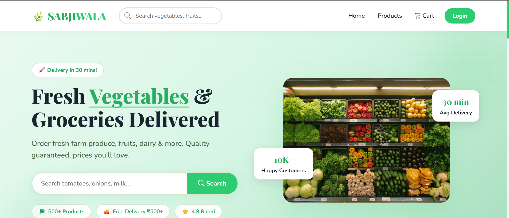
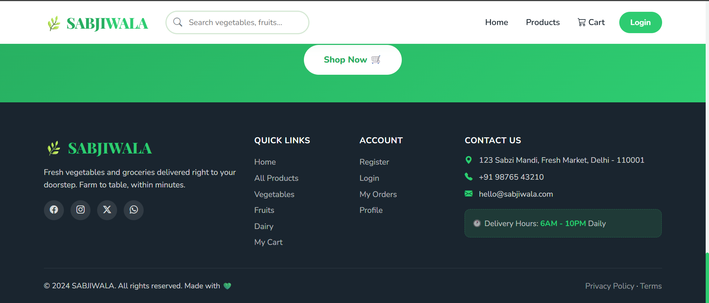
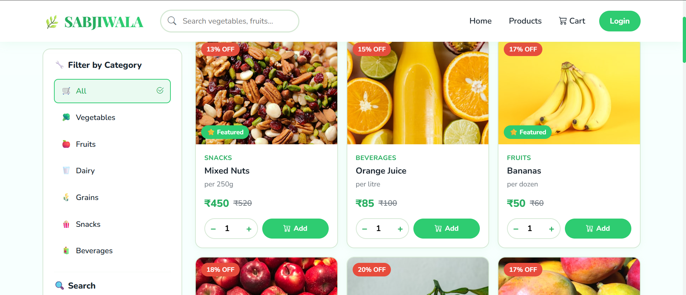
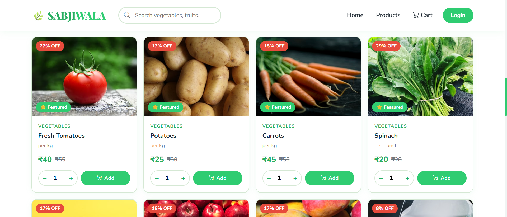
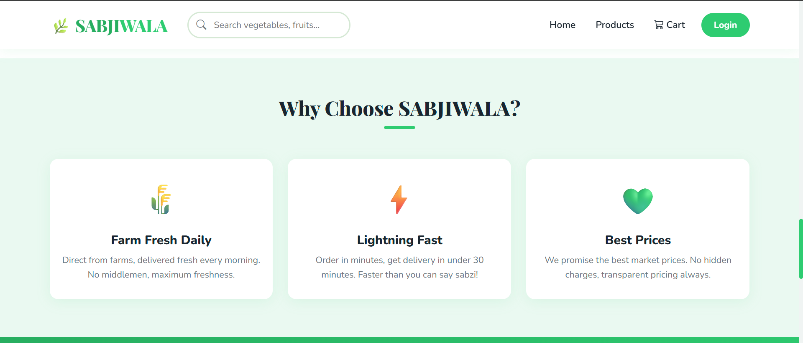
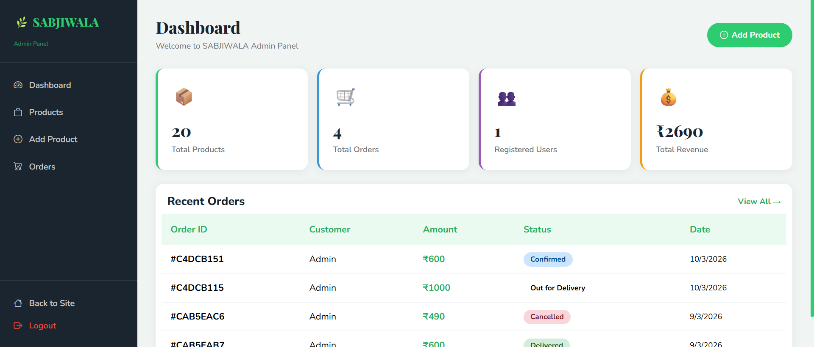
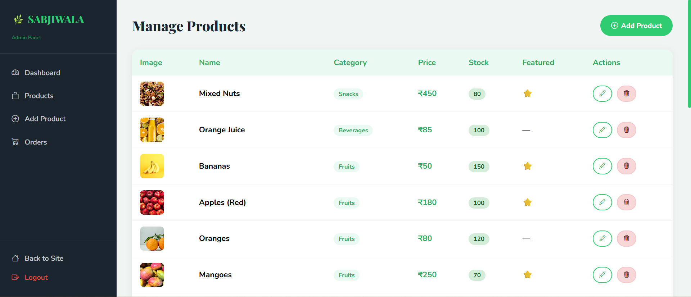
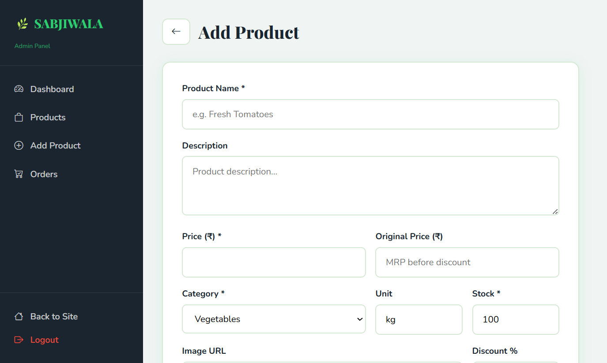
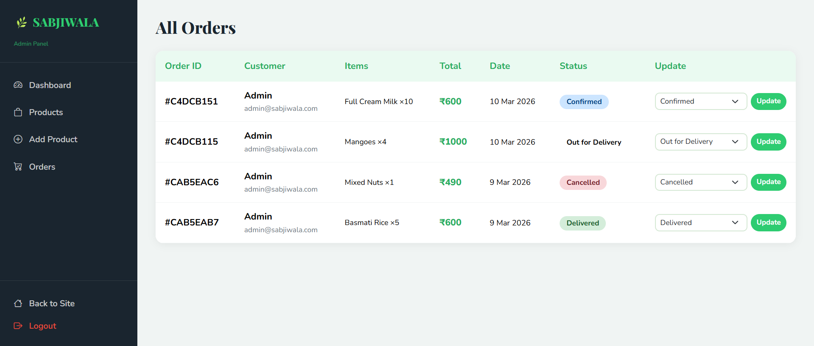

# 🌿 SABJIWALA - Fresh Grocery Delivery App

A full-stack Instamart-style grocery delivery web application built with Node.js, Express, MongoDB, and EJS.

🔗 **Live Demo:** https://sabjiwala-grocery.onrender.com
🐙 **GitHub:** https://github.com/nk7102001/sabjiwala

---

## Screenshots

### Home Page


### Navigation


### Categories


### Products Page


### Why Choose Us


### Admin Panel


### Manage Products


### Add Products


### Manage Orders


---

## 🚀 Quick Start

### Prerequisites
- Node.js v14+
- MongoDB running locally (or MongoDB Atlas URI)

### Installation

```bash
# 1. Install dependencies
npm install

# 2. Start the app (MongoDB must be running)
node server.js

# 3. Open in browser
http://localhost:3000
```

---


## 📂 Project Structure

```
sabjiwala/
├── models/
│   ├── User.js          # User schema
│   ├── Product.js       # Product schema
│   └── Order.js         # Order schema
├── routes/
│   ├── auth.js          # Login / Signup / Logout
│   ├── products.js      # Product listing & detail
│   ├── cart.js          # Cart (session-based)
│   ├── orders.js        # Checkout & order history
│   ├── dashboard.js     # User dashboard
│   └── admin.js         # Admin panel
├── views/
│   ├── partials/
│   │   ├── navbar.ejs
│   │   ├── footer.ejs
│   │   └── product-card.ejs
│   ├── admin/           # Admin panel views
│   ├── home.ejs
│   ├── products.ejs
│   ├── product-detail.ejs
│   ├── cart.ejs
│   ├── checkout.ejs
│   ├── order-confirmation.ejs
│   ├── login.ejs
│   ├── signup.ejs
│   ├── dashboard.ejs
│   └── 404.ejs
├── public/
│   ├── css/style.css
│   └── js/main.js
├── middleware/
│   └── auth.js          # Auth + session helpers
├── server.js            # Main entry point
├── .env                 # Environment variables
└── package.json
```

---

## ✨ Features

- ✅ User authentication (signup/login/logout) with bcrypt
- ✅ Session-based cart (works without login)
- ✅ Product listing with search + category filter + sort
- ✅ Product detail pages with related items
- ✅ Cart with dynamic quantity update & total
- ✅ Checkout with address & payment method
- ✅ Order placement & confirmation
- ✅ User dashboard (profile, orders, address)
- ✅ Admin panel (add/edit/delete products, manage orders)
- ✅ 20 pre-seeded sample products across 6 categories
- ✅ Fully responsive (mobile, tablet, desktop)
- ✅ Flash messages for success/error
- ✅ Free delivery above ₹500

---

## 🌿 Theme

- **Primary:** #2ecc71 (Fresh Green)
- **Secondary:** #27ae60 (Dark Green)
- **Background:** White
- **Fonts:** Playfair Display (headings) + Nunito (body)

---

## 🛠️ Tech Stack

- **Frontend** — EJS, HTML5, CSS3, JavaScript, Bootstrap 5
- **Backend** — Node.js, Express.js, MVC Architecture
- **Database** — MongoDB Atlas, Mongoose
- **Auth** — JWT, bcryptjs, express-session
- **Deployment** — Render
- **Tools** — Git, GitHub, Postman